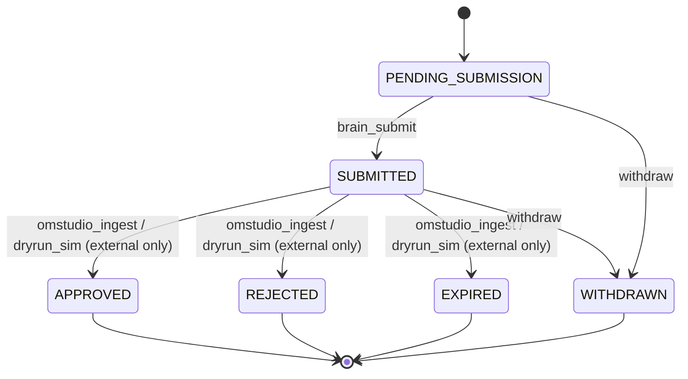

# OMStudio Governance Integration (Phase 1)

This document describes how the Brain surfaces its outputs to the OMStudio
governance surface for **audit** and routes human-only / Tier 0 proposals for
**superadmin approval**. It implements the "integrated into OMStudio governance
surfaces" clause of the Phase 1 definition-of-done.

> **Doctrine invariants preserved throughout:** the deterministic rule engine is
> authoritative; the model is advisory-only; the Brain only observes, explains,
> and recommends; it **never self-approves** and **never executes** governed
> actions; every outbound payload is **redacted before egress**; the OMStudio
> endpoint is **LAN-only** (circuit breaker).

---

## 1. Audit vs. Approval — two distinct records

| | AUDIT event | APPROVAL request |
| --- | --- | --- |
| When | **Every** Brain decision/recommendation | Only `requires_human_superadmin` (human-only domains) **or** `tier0_halt_escalate` |
| Purpose | Append-only visibility/traceability, mirroring `decision_memory` | Route a proposal to a human superadmin for an approve/reject decision |
| Brain role | Emit + mirror locally (`omstudio_audit`) | Create (`PENDING_SUBMISSION`) → submit (`SUBMITTED`); then only **track** |
| Who decides outcome | n/a | A **human** in OMStudio; the Brain can never set the outcome |

Auto-safe recommendations (`service_restart` excl. OM backend,
`reconcile_stale_deploy`, `remove_maintenance_flag`) are **audited** but do
**not** open an approval request. `executed` is always `false`.

---

## 2. ASSUMED interface (the team MUST confirm against the live OMStudio API)

> **CAVEAT:** The exact OMStudio audit/approval REST contract is **not** in the
> provided corpus. The paths and payload shapes below are an **ASSUMED**
> interface, isolated behind a swappable adapter in
> `src/governance/omstudioClient.js`. Confirm and adjust them against the real
> OMStudio API **before** enabling `OMSTUDIO_TRANSPORT=http`. Until then, run in
> the default `dryrun` mode, which exercises the full flow offline.

Adapter interface (stable; only the HTTP transport is assumed):

```
emitAuditEvent(record)        -> { ok, ref, transport }
submitApprovalRequest(proposal) -> { ok, ref, transport }
getApprovalStatus(ref)        -> { ok, state|null, raw }
```

### Assumed HTTP endpoints (mounted under the .242 edge / omstudio-embed front)

| Method | Path (ASSUMED) | Purpose |
| --- | --- | --- |
| POST | `/omstudio-embed/api/governance/brain/audit-events` | emit an audit event |
| POST | `/omstudio-embed/api/governance/brain/approval-requests` | submit an approval request |
| GET | `/omstudio-embed/api/governance/brain/approval-requests/:ref` | poll status |

Authentication: `Authorization: Bearer ${OMSTUDIO_SERVICE_TOKEN}` header only.
The token is on the never-log list; it is **never** placed in a payload and
**never** logged.

### Assumed payload shapes (ASSUMED — confirm)

Audit event (POST audit-events):

```json
{
  "type": "brain_audit_event",
  "emitted_at": "2026-06-17T00:00:00.000Z",
  "decision": {
    "decision_id": 123,
    "session_id": "sess-abc",
    "classification": "requires_human_superadmin",
    "recommendation": "…",
    "rationale": "…",
    "doctrine_rule": "authority.human_only_domains#routing",
    "owning_system": "OMAI",
    "requires_omstudio": true
  }
}
```

Approval request (POST approval-requests):

```json
{
  "type": "brain_approval_request",
  "submitted_at": "2026-06-17T00:00:00.000Z",
  "request": {
    "approval_local_id": 1,
    "source_decision_id": 123,
    "session_id": "sess-abc",
    "classification": "requires_human_superadmin",
    "domains": "routing",
    "proposal_summary": "[requires_human_superadmin] OMAI: …(redacted)…"
  }
}
```

All payloads pass through `redactForLog` immediately before transmission, so no
never-log secret (e.g. `OMSTUDIO_SERVICE_TOKEN`, `DB_PASSWORD`, JWTs, Stripe
keys) or tenant identifier (`church_id`, `om_church_*`) is ever sent.

---

## 3. Transports: dry-run vs http

| Mode | `OMSTUDIO_TRANSPORT` | Behavior |
| --- | --- | --- |
| Dry-run (default) | `dryrun` | Writes each outbound record as a JSON file to `OMSTUDIO_OUTBOX_DIR`. No network call; the circuit breaker is not invoked on the wire. Lets the whole flow be tested without a live OMStudio. |
| Live | `http` | POSTs to the assumed endpoints. The circuit breaker permits **LAN/RFC1918 hosts only**; external hosts (incl. the public placeholder hostname) are refused. Point `OMSTUDIO_GOVERNANCE_BASE_URL` at the LAN edge, e.g. `http://192.168.1.242/omstudio-embed`. |

---

## 4. Approval status ingest (webhook) contract

Outcomes (APPROVED / REJECTED / EXPIRED) are **externally owned**. They reach the
Brain only via:

```
POST /governance/approvals/:id/ingest-status
{
  "decision": "approved",          // approved | rejected | expired | withdrawn
  "source": "omstudio_ingest",     // live webhook. 'dryrun_sim' = operator test-only
  "omstudio_ref": "OMS-… (optional)",
  "note": "optional, redacted"
}
```

- In **live** deployments this is the **webhook target** OMStudio calls when a
  superadmin approves/rejects. Wire OMStudio (or the edge) to POST here.
- In **dry-run** this is how an operator **simulates** an OMStudio decision for
  testing; such calls must use `"source": "dryrun_sim"` and are clearly
  test-only.
- The endpoint applies the status through the deterministic state machine. A
  Brain-owned source can never set APPROVED/REJECTED/EXPIRED.

---

## 5. Approval state machine



Rules enforced in `src/governance/approvalStateMachine.js` (pure, unit-tested):

- Only the listed transitions are valid; everything else is rejected.
- `APPROVED`, `REJECTED`, `EXPIRED` require a **non-Brain** source. A
  `brain_submit` / `brain` / `create` source for those targets is refused with
  reason `state_requires_external_source:<STATE>`.
- Terminal states cannot transition further.
- Every transition is recorded as a **new** append-only row in
  `approval_status_history` (never an overwrite); `approval_requests` is
  non-deletable.

---

## 6. How this satisfies the definition-of-done

- **Linked to governance:** every decision is mirrored to the OMStudio audit
  surface and locally in the append-only `omstudio_audit` table.
- **Required approvals surfaced:** human-only / Tier 0 proposals are routed to
  OMStudio as `SUBMITTED` approval requests with `requires_human_superadmin
  approval via OMStudio`.
- **Doctrine intact:** deterministic gates authoritative, model advisory-only,
  observe/explain/recommend only, never self-approve, never execute, redact
  before egress, LAN-only.
